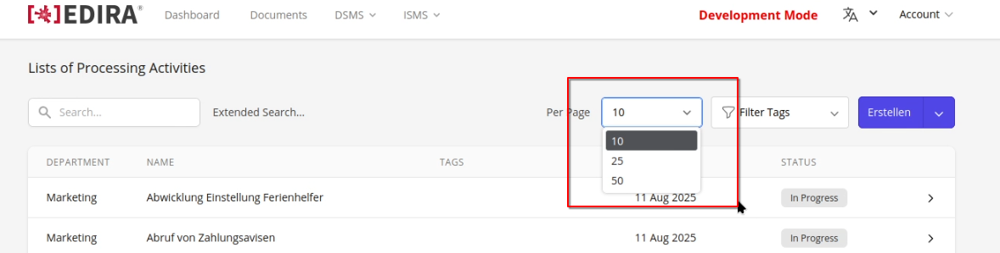

# Issue 131

## Task

Aktuell ist der Filter, wie viele VVTs im Index angezeigt werden, auf maximal 50 limitiert. Hier soll dieser Filter um 100 und alle erweitert werden.



## Modified Files

```
.
└── resources/
    ├── views/                  
    │   └── livewire/
    │       └──  vvt/
    │           └── index.blade.php  
    └── lang/
        ├── en/                  
        │   └──  vvt.php
        └── de/    
            └──  vvt.php
       
```

---

## Solution

Dass Dropdown Menu kann direkt in `index.blade.php` um die gewünschten Punkte erweitert werden:

```html
<x-input.group borderless paddingless for="perPage" label="{{ __('datatable.labels.per_page') }}">
    <x-input.select wire:model.live="perPage" id="perPage">
        <option value="10">10</option>
        <option value="25">25</option>
        <option value="50">50</option>
        // Option für 100 VVTs
        <option value="100">100</option>   
        // Option für alle VVTs. Wurde über Anzahl 10000 gelöst, da es unrealistisch ist, dass mehr VVTs erstellt werden.
        <option value="10000">{{ trans('vvt.all') }}</option>   
    </x-input.select>
</x-input.group>

```

!!! Warning
    Falls es doch wahrscheinlich wird, dass User mehr als 10.000 VVTs erstellen, muss dies angepasst werden.

In den Language Files wurde ein dynamischer Text für `Alle` hinzugefügt, welcher in der UI im Dropdown Menu dargestellt wird:

`/de/vvt.php`:

```php
'all' => 'Alle',
```

`/en/vvt.php`:

```php
'all' => 'All',
```

## Result

<video width="640" height="360" controls>
    <source src="../src/img/1.mp4" type="video/mp4">
    Your browser does not support the video tag.
</video>