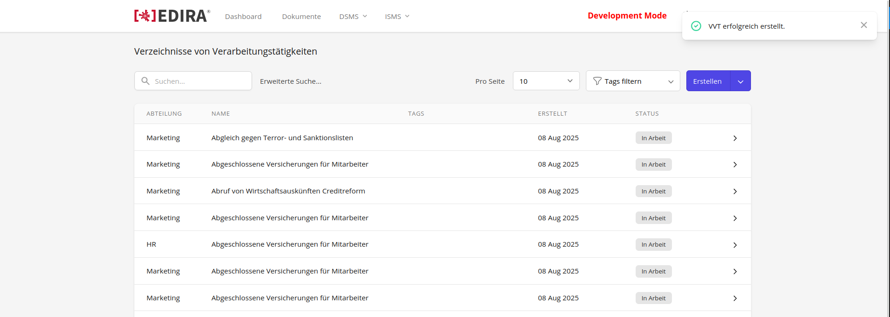

# Issue 159

## Tasks

Aktuell gibt es keine Benachrichtigung, wenn ein VVT erfolgreich erstellt wird. Diese soll als Alert Pop-Up auf der nachfolgende Seite, zu dem der User umgeleitet wird, eingeblendet werden.

## Problem Breakdown

Um Notifications auf einer Seite anzeigen zu lassen, gibt es einen View Component `notification.blade.php`. Aktuell schaut dieser in dem Laravel Session Storage danach, ob ein Attribut mit dem Namen `alert` existiert. Wenn dies der Fall ist, wird der Component, mit dem hinterlegten Value in der Session angezeigt. 

Über ein Macro in `AppServiceProvider.php` wird ein Method eingefügt, über die man die Anzeiger der Notification View triggern kann:

```php
Component::macro('alert', function ($type, $message, $time = 2500) {
    $this->dispatch('notify', id: uniqid(), type: $type, message: $message, time: $time);
});
```

So wird z.B. ein Alert in dem Controller getriggert, der ein VVT ohne Vorlage erstellt:

```php
$this->alert('success', __('vvt.alerts.created'));
```

Das Problem hierbei ist jedoch, dass dies nur funktioniert, wenn man auf der gleichen Page bleibt, wenn der Alert getriggert wird. Da man jedoch beim erstellen eines VVT nach einer Vorlage auf einer eigenen Seite ist und anschließend zur VVT Übersicht weitergeleitet wird, muss die Notification auf einer anderen Seite aktiviert werden. 

Dies ist ebenfalls der Fall bei dem Livewire Component Controller `VersionShow.php` für Nis. Dort wird zur nächsten Seite mit der Laravel Klasse `Redirect` durchgeführt. Dies ermöglicht es, die Klassenfunktion `with()` beim redirecten zu nutzen, welche Daten in den Session Storage flasht, woraufhin dann der Notifier getriggert wird:

```php
if (auth()->user()?->isAuditor() && $version->status === 'in_progress') {
    Redirect::route('nis.index')->with('alert', trans('nis.alerts.auditor_no_access'));

    return;
}
```

Der Redirect nachdem man ein VVT nach Vorlage erstellt hat, geschieht jedoch durch einen Alpine.js Funktion in `query-vvt-templates.blade.php`:

```js
async submitTemplates() {

    let formData = {
    }

    await fetch(this.url, {
            method: 'POST',
            headers: {
                'Content-Type': 'application/json',
                Accept: 'application/json',
            },
            body: JSON.stringify(formData),
        })
        .then((response) => response.json())
        .then((data) => {
            this.redirect = data

        }).catch(() => {
        }).finally(() => {
            window.location.replace(this.redirect)
        });
},
```

## Modified Files

```
.
├── resources/
│   └── views/                  
│       └── components/
│           └── notifications.blade.php
└── app/
    └── Http/                  
        └── Controllers/
            └── VvtTemplateController.pho/
                
```

## Solution

Da man nicht `Redirect::with()` benutzen, um die Variablen in der Session zu erstellen, musste für diesen Einzelfall eine eigene Lösung gefunden werden. Das heißt, dass man in `VvtTemplateController.php` manuell die Variablen erstellen muss:

```php
session(['alert' => trans('vvt.alerts.created')]);
session(['type' => 'success']);
```

Anschließend muss `notification.blade.php` so angepasst werden, dass einerseits nach dem Abrufen, die Variablen wieder gelöscht werden:

```php
@session('alert') x-init="add({ message: '{{ session()->pull('alert') }}', time: 5000, type: '{{ session()->pull('type', 'error') }}' })" @endsession
```

## Result



!!! Note
    Success Alert wird nach erstellen angezeigt.

