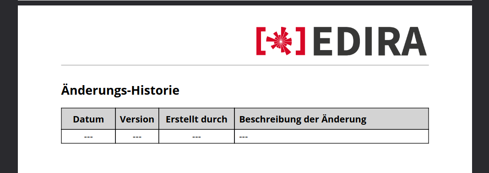
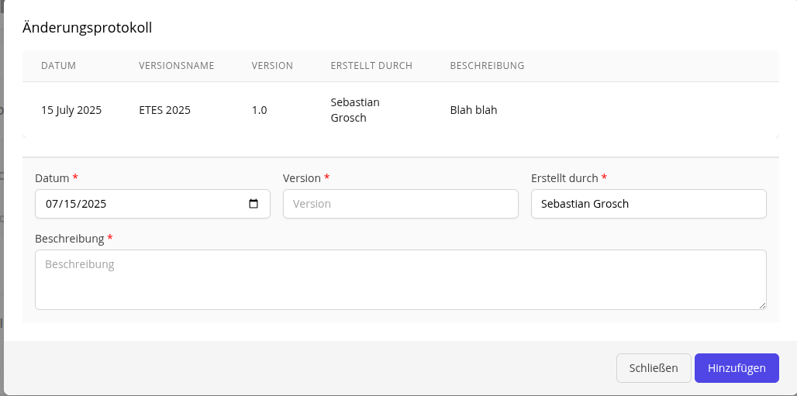

# 336

[Git Issue 336](https://git.etes.de/edira/edira/-/issues/336)

## Problem 1

### Breakdown

Wenn ein initialer SOA angelegt wird, ist in dem generierten PDF Dokument auf Seite 2 unter der Änderungs-Historie die Tabelle mit Default-Werten gefüllt. Hier kam die Frage auf, ob diese Seite erst ab der ersten Änderung generiert werden soll. Gewünscht ist zunächst, die Tabelle wie im NIS Bereich mit leeren Strichen zu füllen

Zudem soll im Dashboard unter Änderungsprotokoll neben der Versionsnummer ein Versionsname hinzugefügt werden können. Dies soll zunächst nur in der GUI und nicht in der Änderungshistorie des .pdf Dokuments wiedergespiegelt werden.

### Solution 

Dateien die geändert werden:

Livewire Component:
- `app/Http/Livewire/Soa/Changelog.php`

Livewire Action:
- `app/Actions/Soa/VersionCreateAction.php`

Database Migration: 
- `database/migrations/2021_10_15_164938_create_soa_changelogs_table.php`

GUI View:
- `resources/views/livewire/soa/changelog.blade.php`

PDF View:
- `resources/views/pdf/soa/changelog.blade.php`

Language:
- `resources/lang/de/forms.php`
- `resources/lang/en/forms.php`

#### Default Block PDF löschen

In der Datei `app/Actions/Soa/VersionCreateAction.php` wurde der Codeblock gelöscht, der dafür verantwortlich war, dass die falschen Default-Werte in die Änderungshistorie eingetragen wurde. 

####