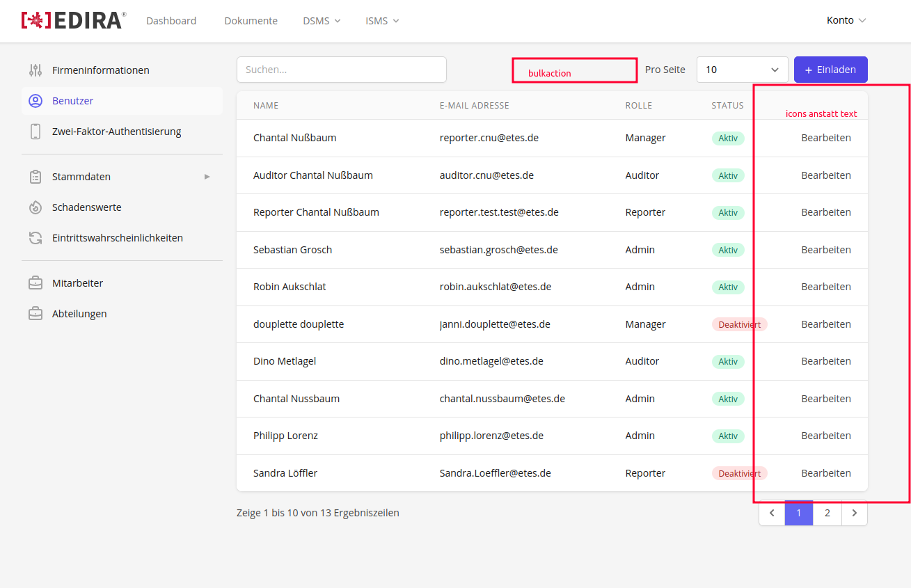
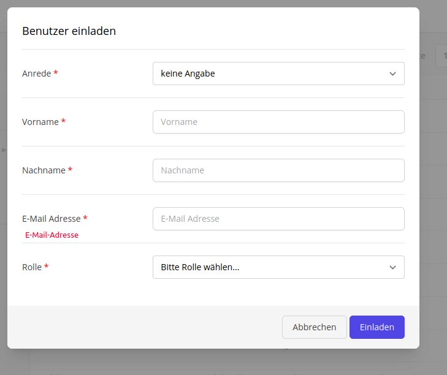
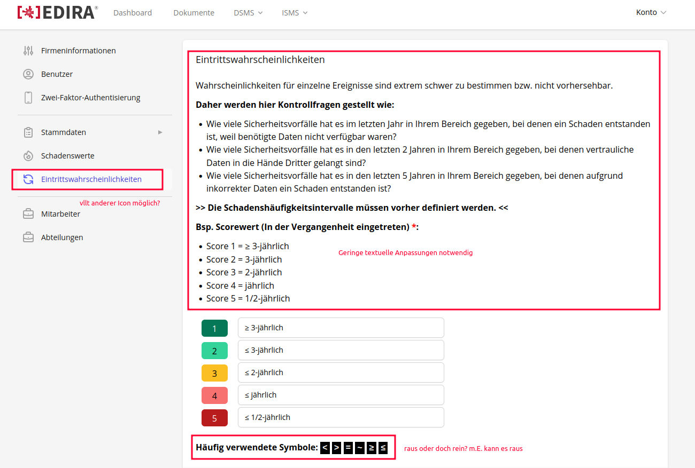
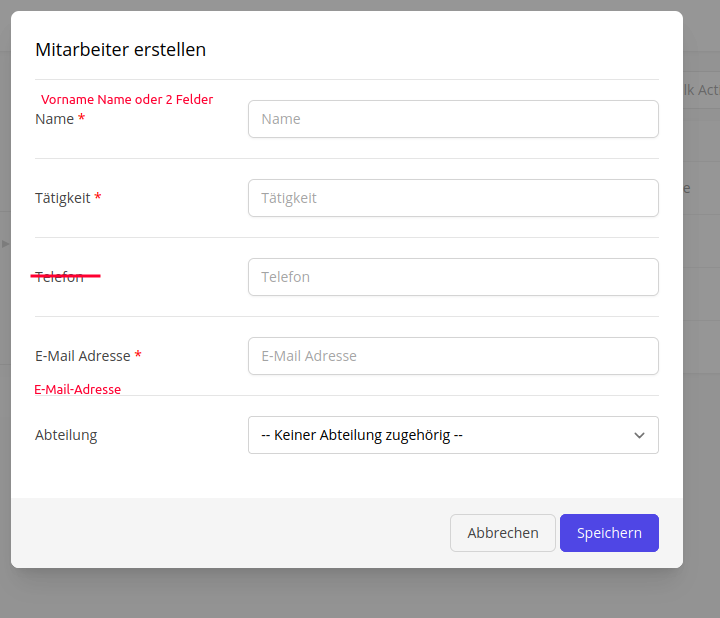
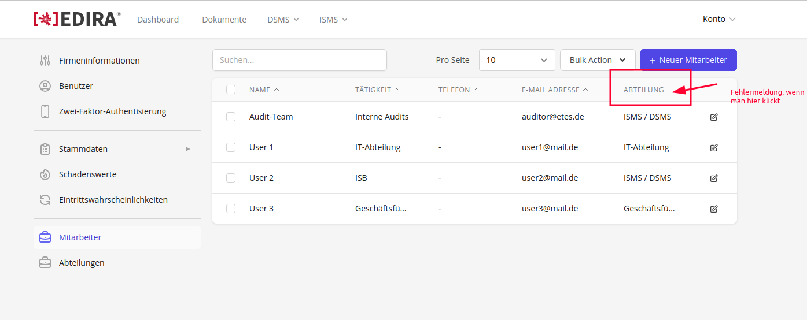
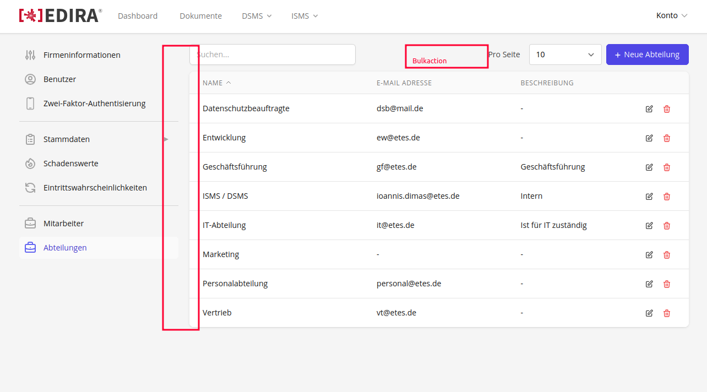
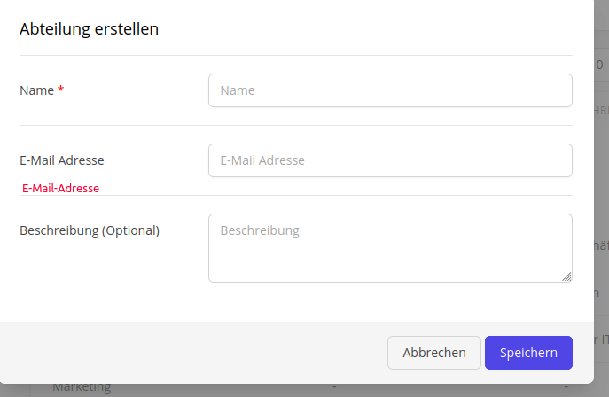

# Issue 373

[Git Issue 373](https://git.etes.de/edira/edira/-/issues/373)

## Task 1 Stammdaten

### Breakdown

- Reiter Firmeninformationen in Reiter Stammdaten integrieren
- Anstatt `Verantwortlicher` -> `Unternehmen`
- Aktuelle Stammdaten Unterreiter sollen alles auf einer Page sein
- Aktuell wird alles in Table `master_records` gespeichert, die einzelnen Punkte sollen in jeweilige Tables aufgesplittet werden
- 


### Modified Files

```
.
├── /
│   └── /                  
│       └── /
│           └── /
│               └── .php  
└── /
    └── /                  
        └── /
            └── /
                └── .php  
```

### Solution

### Result

## Task 2 Benutzer

### Breakdown

- ausgeschriebenes Bearbeiten soll zu Icon geändert werden 
- Bulk Action soll hinzugefügt werden 
  -> welche Bulkactions sollen hier möglich sein (eine war Benutzer deaktivieren) 
- Rechtschreibung Modal Benutzer erstellen anpassen





### Modified Files

```
.
├── /
│   └── /                  
│       └── /
│           └── /
│               └── .php  
└── /
    └── /                  
        └── /
            └── /
                └── .php  
```

### Solution

### Result

## Task 3 Schadenswerte

### Breakdown

- Condition Zeichen sollen als Dropdown Menu in Input Field integriert werden (Default wie angezeigt) -> Häufig verwendete Symbole anschließend raus
- Inhaltliche Textanpassung
- Geld Werte sollen nach drei stellen durch Punk getrennt werden 



### Modified Files

```
.
├── /
│   └── /                  
│       └── /
│           └── /
│               └── .php  
└── /
    └── /                  
        └── /
            └── /
                └── .php  
```

### Solution

### Result

## Task 4 Mitarbeiter

### Breakdown

- Tooltip Menu um Bulkaction auszuführen, nachdem mehrere Objekte ausgewählt wurden
- Rechtschreibung Modal Mitarbeiter erstellen anpassen
- Error wenn man nach abteilung sortiert





### Modified Files

```
.
├── /
│   └── /                  
│       └── /
│           └── /
│               └── .php  
└── /
    └── /                  
        └── /
            └── /
                └── .php  
```

### Solution

### Result

## Task 5 Abteilungen

### Breakdown

- Objektauswahl und Bulkaction hinzufügen
  -> welche Bulkactions werden noch mehr konkretisiert
- Rechtschreibung Modal Abteilung erstellen anpassen





Hier ist noch Rücksprache für das Verhalten erforderlich:
        
- Checkboxen können ausgewählt werden, entweder einzeln ausgewählt oder gleich alle (select all)
- Sobald ein oder mehrere Kästchen ausgewählt werden, erscheint ein Button/ kleines modal für Aktionen
- Aktionen: Löschen, exportieren (vllt gibt es später mal mehr)
- Löschen: erst möglich, wenn Bestätigung erfolgte

### Modified Files

```
.
├── /
│   └── /                  
│       └── /
│           └── /
│               └── .php  
└── /
    └── /                  
        └── /
            └── /
                └── .php  
```

### Solution

### Result

## Task Unklar

### Breakdown

- Reiter Vertraulichkeitsstufen für VVT


### Modified Files

```
.
├── /
│   └── /                  
│       └── /
│           └── /
│               └── .php  
└── /
    └── /                  
        └── /
            └── /
                └── .php  
```

### Solution

### Result