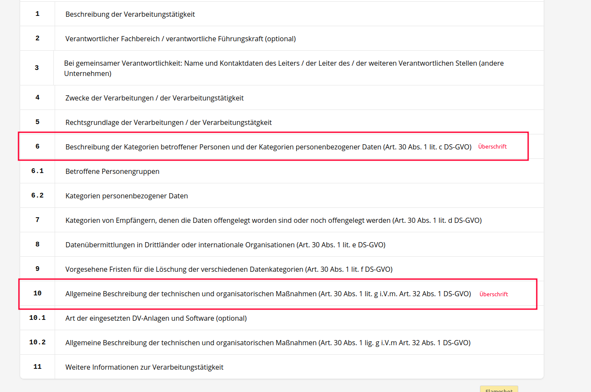
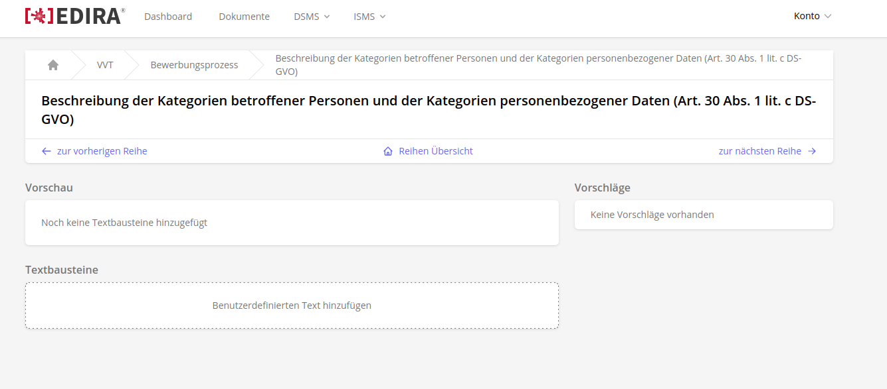
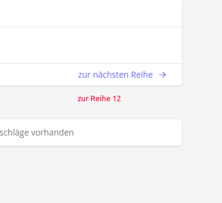
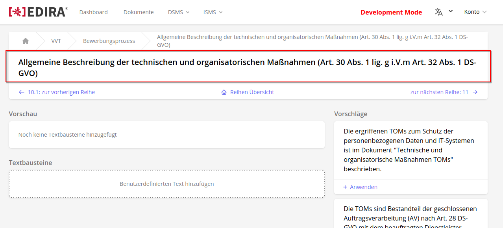
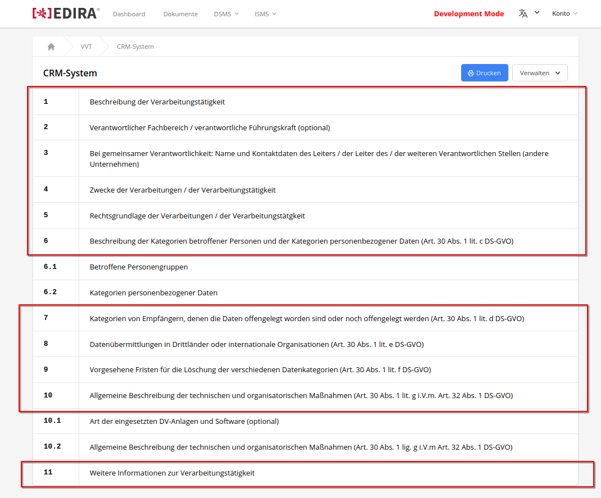
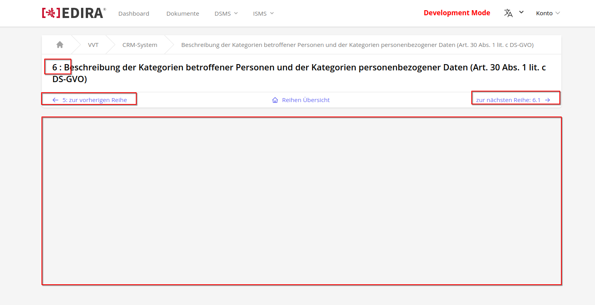
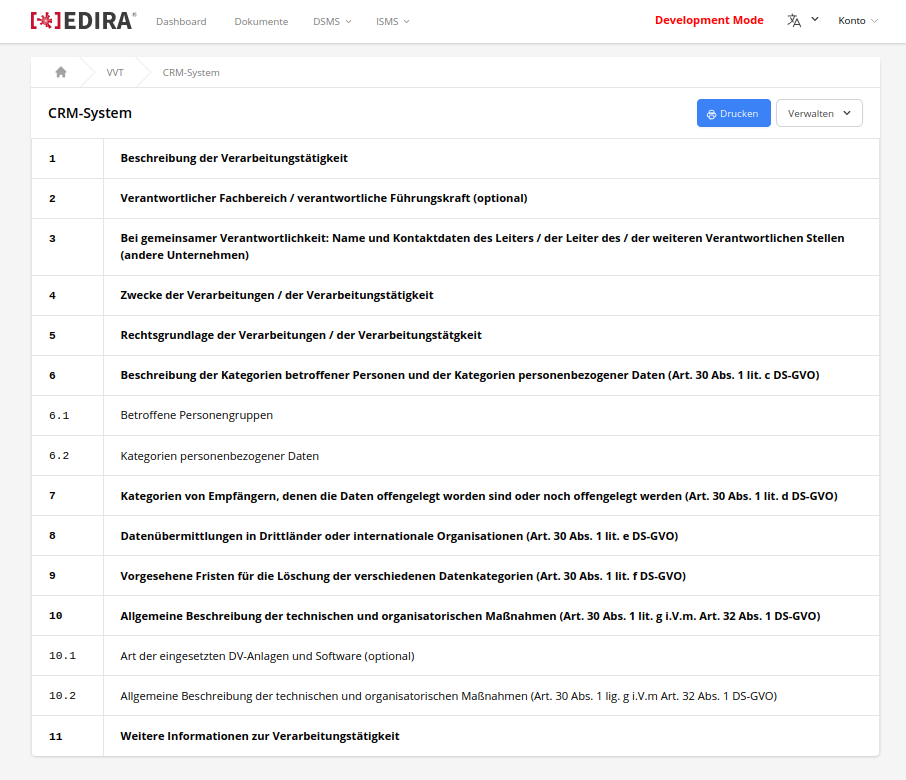

# Issue 382

## Tasks

### 1. User Content Funktionen Parent Kapitel VVT Entfernen

In der Kapitel Übersicht eines VVT haben manche Kapitel Unterkapitel (z.b. 6 -> 6.1 & 6.2). 



Aktuell haben diese Überkapitel die Funktionen mit denen User Content hinzufügen können. Dies ist jedoch nicht nötig, da nur die Unterkapitel User Input bekommen sollen. 



!!! Note
    Vorschau, Vorschläge und Textbausteine für Kapitel 6 und 10 werden nicht benötigt.

Deswegen soll der Inhalt der Seite für die Überkapitel entfernt werden. 


!!! Note
    Gewünschte Umsetzung der Seiten für Kapitel 6 und 10.

### 2. Seitennavigation in Reihenansicht 

Zudem soll bei den Navigationsbutton in der Reihenansicht, die zum vorherigen sowie nächsten Kapitel führen, die jeweile Kapitelnummer angezeigt werden, damit der User sich orientieren kann, an welchem Punkt er sich aktuell befindet.



Um besser erschließen zu können, welches Kapitel man gerade bearbeitet, soll in der Überschrift neben dem Namen auch die Kapitelnummer mit aufgeführt werden.



!!! Note 
    Aktuell wird auf Seite nicht direkt deutlich welches Kapitel man bearbeitet.

### 3. Überschriften hervorheben in VVT Übersicht

Auf der Übersichtseite des VVT soll kenntlicher gemacht werden, bei welchen Kapiteln es sich um die Überschriften handeln soll



!!! Note
    Die rot markierten Kapitel sollen hervorgehoben werden. 

## Modified Files

```
.
├── app/
│   └── Http/                  
│       └── Livewire/
│           └── Vvt/
│               └── View.php  
└── resources/
    └── views/                  
        └── livewire/
            └── vvt/
                ├── rows/ 
                │   └── edit.blade.php
                └── view.blade.php  
```

## Solution

### Task 1

In `edit.blade.php` sind alle User Input Funktionen in einem `<div>` untergegliedert. Dies macht es einfach, zu entscheiden, ob sie gerendert werden sollen, indem man eine `if` conditional implementiert, bei der geprüft wird, ob es sich um ein Überkapitel handelt.

```php 
//if chapter is not a parentchapter then it displays the user content input
@if ($this ->row->number !== 6.0 && $this ->row->number !== 10.0)
    <div class="grid grid-cols-3 gap-6">
        <div class="col-span-2 space-y-6">
            // Preview
            <div class="space-y-2">
            </div>
            //Custom Text
            <div class="space-y-2">
            </div>
        </div>
        // Suggestions   
        <div class="col-span-1 space-y-2">
        </div>
    </div>
@endif  
```

!!! Warning
    Die Logik dieses Codes ist anfällig für Änderungen des Tables `vvt_rows`.
    Es würde Sinn machen, dem Table ein Column (z.B. `parent_chapter`) zu geben, über das definiert wird, ob es sich um ein Kapitel handelt, in dem die User-Input-Funktionen benötigt werden. 

### Task 2

Die Kapitelnummern des vorherigen und nächsten Kapitel sind in den Objekten `$previousRow` und `$nextRow` als Attribut `number gespeichert`.

In den jeweiligen Buttons wurden diese so implementiert:

```php
@if ($previousRow)
    <a href="{{ route('dsms.vvt.rows.edit', ['vvt' => $vvt, 'row' => $previousRow]) }}"
        class="col-span-1 flex items-center space-x-2 text-sm text-indigo-500">
        <x-icon.arrow-left size="4" />
        // chapter number gets added here
        <span>{{ $previousRow->number }}: {{ __('vvt.row.goto_previous') }}</span>
    </a>
@else
    <div class="col-span-1"></div>
@endif
```

```php
@if ($nextRow)
    <a href="{{ route('dsms.vvt.rows.edit', ['vvt' => $vvt, 'row' => $nextRow]) }}"
        class="col-span-1 flex items-center justify-end space-x-2 text-sm text-indigo-500">
        // chapter number gets added here
        <span>{{ __('vvt.row.goto_next') }}: {{ $nextRow->number }}</span>
        <x-icon.arrow-right size="4" />
    </a>
@else
    <div class="col-span-1"></div>
@endif
```

Die Kapitelnummer der aktuelle Reihenansicht wird hier eingefügt:

```php
<div class="flex justify-between px-6 py-4">
    <h1 class="text-xl font-semibold"> {{ $row->number }} : {{ $row->name }}</h1>
</div>
```

### Task 3

Zunächst wurde eine Funktion in dem Component `View.php` hinzugefügt, mit der geprüft wird, ob die Kapitelnummer eine Dezimalzahl beinhaltet:

```php
public function containsDecimal($value): bool {
    if (strpos($value, ".") !== false) {
        return true;
    }
    return false;
}
```

In der View `view.blade.php` wird mit dieser Funktion geprüft, ob die Kapitelnummer der aktuellen Reihe eine Dezimalzahl ist. Falls dies der Fall ist, wird anschließend der Kapitelnummer und Titel nicht bold gerendert. Umgekehrt werden sie bold gerendert:

```php
// makes title bold if its main chapter
@if(! $this->containsDecimal($row->number))
    // `col-span-1 defines the width part of p element in the row element`
    <p class="col-span-1 items-center justify-center px-6 py-4 font-mono font-semibold text-l">
    {{ $row->number }}
    </p>
    //`col-span-11 defines the width part of h2 element in the row element`
    <h2 class="col-span-11 px-6 py-4 text-l font-bold">
        {{ $row->name }}
    </h2>
@else
    <p class="col-span-1 items-center justify-center px-6 py-4 font-mono text-l">
        {{ $row->number }}
    </p>
    <h2 class="col-span-11 px-6 py-4 text-l">
        {{ $row->name }}
    </h2>
@endif
```

!!! Warning 
    Dies ist Anfällig dafür, wenn die Kapitelnummer in Zukunft alle zu Dezimalzahlen geändert werden
    
    z.B:
    4 -> 4.0

## Result



!!! Info
    - Aktuelle Kapitelnummer wurde zu Titel hinzugefügt
    - Vorherige und Nächste Kapitelnummer wurde zu Buttons hinzugefügt
    - Funktionen wurden für Kapitel 6 & 10 entfernt



!!! Info 
    - Hauptkapitel wurden hervorgehoben
    - Unterkapitel gleich groß aber nicht bold