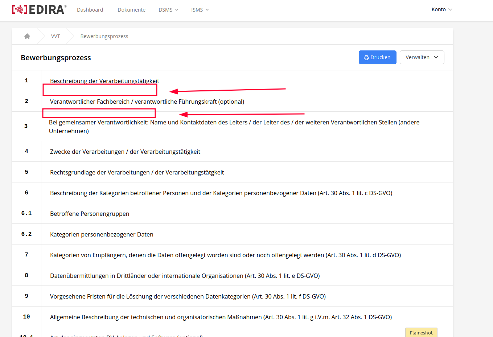
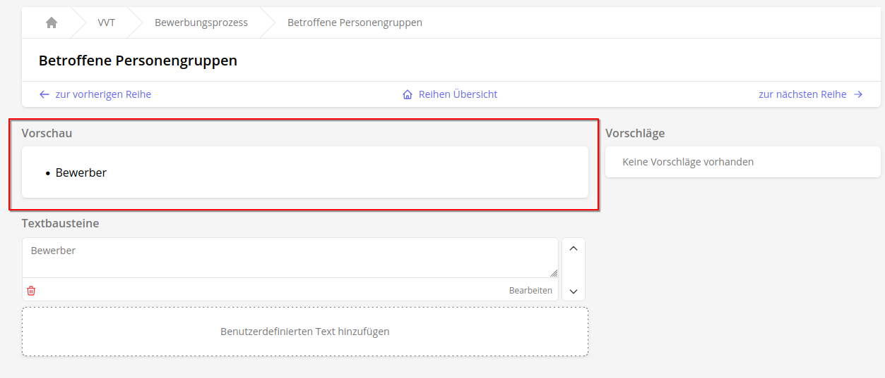
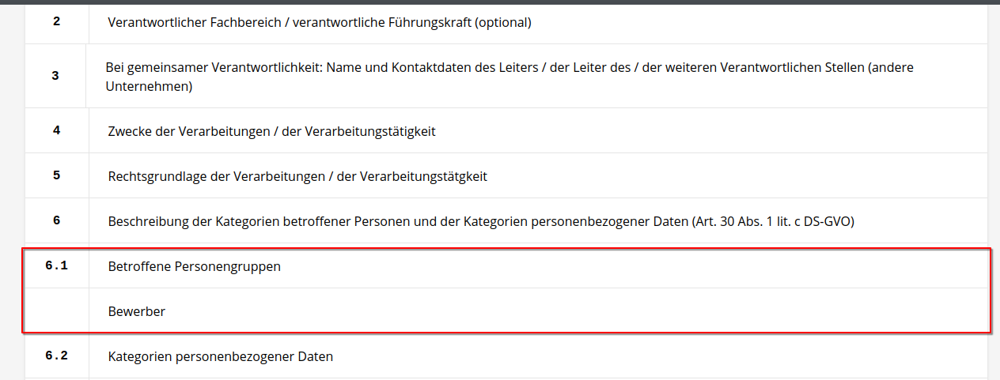
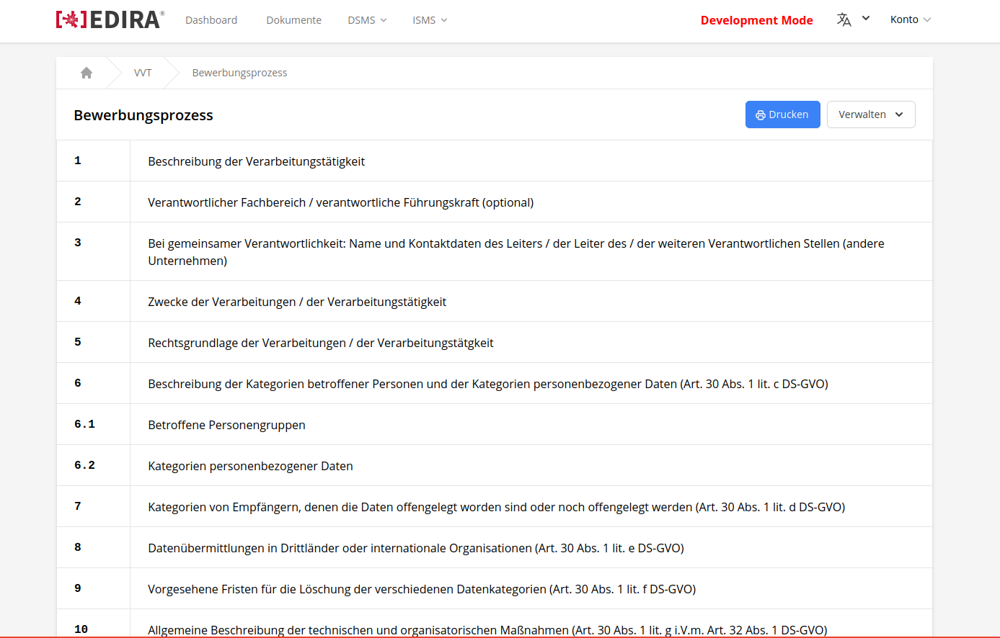
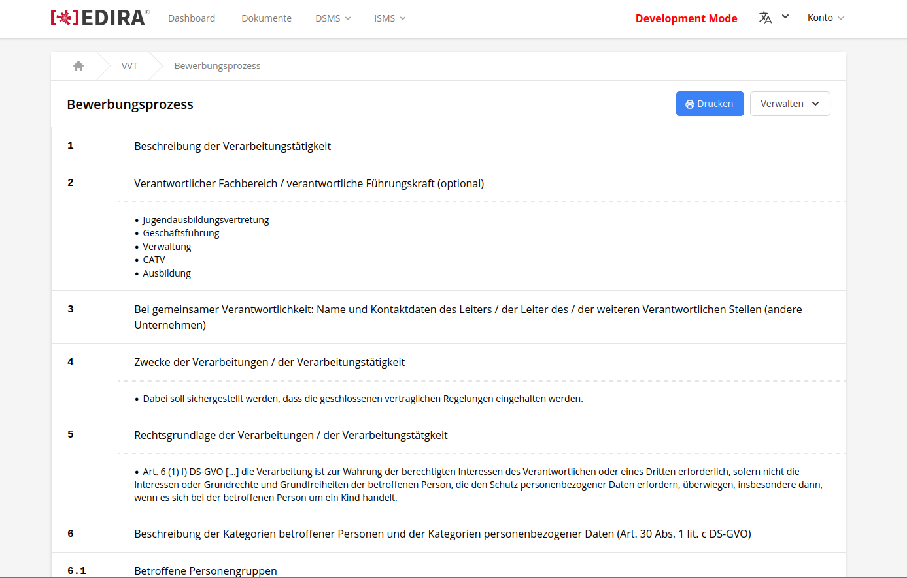

# 383

[Git Issue 383](https://work-documentation.jroedel-work.gitlab.io/)

## Breakdown 

Auf der Übersichtsseite eines spezifischens VVT sind nur die generischen Überschriften der zu bearbeitenen Punkte sichtbar. Da diese gleich bei unterschiedlichen VVTs sind, ist gewünscht die bereits bearbeiteten und eingefügten spezifischen Daten als Vorschau mit auf der Übersichtsseite mit anzuzeigen. Dies soll zu einer leichteren Suche, Prüfung und Vervollständigung der Einträge führen. 



!!! Info
    Alte Version, rote Markierung zeigt an, an welchen Stellen Vorschau eingebaut werden soll



!!! Info
    Der Inhalt der Seite für einen spezifischen Bearbeitungspunkt eines VVT, der auf der Übersichtsseite angezeigt werden soll.



!!! Info
    Wie der Inhalt platziert werden soll.

## Related Files

```
.
├── app/
│   └── Http/                  
│       └── Livewire/
│           └── Vvt/
│               └── View.php  
└── resources/
    └── views/                  
        └── livewire/
            └── vvt/
                └── view.blade.php  
```

## Solution

### Component

Im Component für die Übersich des spezifischen VVT, wird bereits ein `$vvt` Objekt erstellt, in dem Daten aus den Tables `vvt_rows` und `vvt_values` gespeichert wird. Aktuell werden schon die Daten aus dem `vvt_rows` table als Array an die View weitergegeben. Damit die User generierten Beiträge für jede Row mit angezeigt werden können, müssen die Daten aus dem `vvt_values` table ebenfalls als Array mit an die View übergeben werden:

```php
public function render(): \Illuminate\Contracts\View\View
{ 
    return view('livewire.vvt.view', ['rows' => $this->rows], ['values' => $this -> vvt -> values])
        ->layout('layouts.app', ['title' => 'VVT Bearbeiten']);
}
```
!!!Note
    In der `render()` Funktion werden die relevanten Teile übergeben

    ```php
    ['values' => $this -> vvt -> values]
    ```
    Ist dabei speziell für die Daten aus `vvt_values` zuständig.

### View

In der View muss für jedes Element des `$rows` Array ein Element erstellt werden. Dabei muss geprüft werden, ob es für diese Row zugewiesene Elemente aus `$values` gibt. Falls dies zutrifft, muss das HTML-Element um eine weitere Row erweitert werden, welche die User-Einträge beinhaltet.

```php
{{-- creates row element for every row --}}
@foreach ($rows as $row)

    // <a> element is the parent for static content from `vvt_rows` and dynamic content from `vvt_values`
    // <a> element needs group class so the hover effect works for all child elements
    <a href="{{ route('dsms.vvt.rows.edit', [$vvt, $row]) }}" class="group group-hover:bg-gray-100 ">

        // this div displays the content from the `vvt_rows table`
        // `grid-cols-12` defines the amount of divided parts of the row
        // group hover class is needed so the hover effect works 
        <div class="grid grid-cols-12 group-hover:bg-gray-100 border-l border-r border-t divide-x">

            // `col-span-1 defines the width part of p element in the row element`
            <p class="col-span-1 items-center justify-center px-6 py-4 font-mono font-semibold">
                {{ $row->number }}
            </p>

            // `col-span-11 defines the width part of h2 element in the row element`
            <h2 class="col-span-11 px-6 py-4">
                {{ $row->name }}
            </h2>
        </div>

        // this parent div only gets created if there is one or multiple assigned values for the row form the 'vvt_values' table 
        // if condition checkes if there is an `row_id` value for the row
        @if ($values->where('row_id', $row->id)->isNotEmpty())

            // `grid-cols-12` defines the amount of divided parts of the row 
            // group hover class is needed so the hover effect works
            <div class="grid grid-cols-12 group-hover:bg-gray-100 border-l border-r">

                // this empty div is needed to create the same y-space as the <p> element above
                // `col-span-1 defines the width part of p element in the row element`
                <div class="col-span-1 px-6 py-4"></div>

                // `col-span-11 defines the width part of h2 element in the row element`
                <div class="col-span-11 border-l border-solid">
                    <ul class=" px-6 py-4 border-t-2 border-dashed list-disc list-inside">
                        
                        // checks if there are multiple elements in values assigned to the row 
                        @foreach ($values as $value)
                            @if ($value->row_id === $row->id)
                                <li class="text-sm">{{ $value->body }}</li>
                            @endif
                        @endforeach
                    </ul>
                </div>
            </div>
        @endif
    </a>
@endforeach    
```

## Result



!!! Note
    VVT Übersicht ohne User-Content.



!!! Note
    VVT Übersicht mit User-Content.
    
    Es wird mit einer dashed Line zwischen Headline und User-Content getrennt